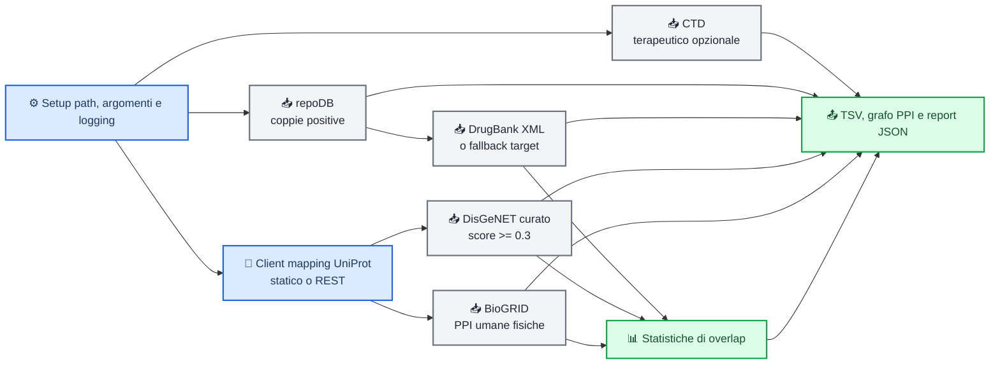

# step01_fetch_data

_Documentazione operativa dello script `script/step01_fetch_data.py` e dei passaggi eseguiti per costruire i dati di input dello step 01._

---

## 📋 Panoramica

`step01_fetch_data.py` prepara i dataset di base usati nella pipeline drug-disease / sensitive PPIN. Lo script combina sorgenti eterogenee, normalizza gli identificativi proteici verso UniProt, filtra le associazioni rilevanti e produce sia tabelle intermedie sia un grafo PPI finale in formato `pickle`.

In pratica, lo step fa cinque cose:

1. raccoglie le coppie farmaco-malattia positive da repoDB
2. estrae le associazioni terapeutiche da CTD, se abilitate
3. costruisce la tabella farmaco-target a partire da DrugBank XML o da un file fallback
4. ricava le proteine malattia da DisGeNET e le mappa verso UniProt
5. filtra BioGRID per ottenere una rete PPI umana fisica e misura l'overlap con target e proteine malattia

##  Flusso dello step



## 🧭 Sequenza dei passaggi

### Risoluzione dell'ambiente

All'avvio lo script:

- calcola `_SCRIPT_DIR` e `_REPO_ROOT` per rendere i path indipendenti dalla current working directory
- aggiunge `src/` al `sys.path`, così i moduli condivisi sono importabili anche se il comando viene lanciato da un'altra directory
- configura il logging con livello parametrico tramite `--logging-level`
- crea `output-dir` e `cache-dir` se non esistono

### Preparazione di repoDB

La sorgente `repoDB` è obbligatoria e viene letta da `--repodb-file`. Il file è normalizzato con `normalize_repodb_positives`, che:

- risolve nomi colonna alternativi come `drug_id`, `drugbank_id`, `disease_name` o alias simili
- mantiene solo gli stati indicati in `--repodb-positive-status` (di default `approved`)
- produce una tabella positiva con `DrugBankID`, `DrugName`, `DiseaseName`, `DiseaseID` e `Label=1`
- elimina righe vuote e duplicati su coppia farmaco-malattia

L'output viene salvato come `repodb_approved.tsv`.

### Gestione di CTD

CTD è opzionale. Se non viene passato `--skip-ctd`, lo script:

- usa un file locale specificato con `--ctd-file`, se presente
- altrimenti prova a riusare il file nella cache
- in ultima istanza scarica `CTD_chemicals_diseases.tsv.gz` da CTD[^1]

Sul file CTD viene applicato un filtro streaming chunked che:

- legge il `.tsv.gz` a blocchi per contenere l'uso di memoria
- mantiene solo le righe con `DirectEvidence = therapeutic`
- conserva le colonne `ChemicalName`, `ChemicalID`, `DiseaseName`, `DiseaseID`
- rimuove i duplicati

L'output viene salvato come `ctd_therapeutic.tsv`.

### Costruzione del client di mapping UniProt

Per mappare gene ID e simboli verso accession UniProt, lo script usa due modalità:

- `StaticMappingClient` se viene fornito `--disgenet-mapping-tsv`
- `UniProtMappingClient` via REST se non viene fornito un mapping statico[^2]

Il client statico è utile per smoke test o esecuzioni offline. Il client REST sottomette un job di ID mapping a UniProt, ne polla lo stato e concatena le pagine di risultato.

### Preparazione dei target farmaco

Lo step prova prima a leggere `--drugbank-xml`. Se il file esiste:

- estrae i target dal dump XML di DrugBank
- considera solo target umani
- mantiene solo target con `known-action = yes`
- usa l'ID della polypeptide come `TargetUniProtID`
- aggrega le azioni in `Action`

Se il file XML non è disponibile, usa `--drug-target-fallback`. In quel caso:

- legge un file tabellare con almeno `drug_id`, `drug_name`, `target_id`
- rinomina i campi in `DrugBankID`, `DrugName`, `TargetUniProtID`
- cerca una colonna azione come `action_type` o `mechanism_of_action`
- se è disponibile anche repoDB, prova a riallineare i `DrugBankID` usando il nome del farmaco presente in repoDB
- filtra infine gli ID che iniziano con `DB`

L'output viene salvato come `drugbank_targets.tsv`.

### Preparazione di DisGeNET

Per DisGeNET lo script:

- cerca `DISGENET_API_KEY` nelle variabili d'ambiente
- la passa nell'header `Authorization` se presente
- usa un file locale `--disgenet-file`, oppure cache, oppure download diretto del dump curato[^3]

Il processing vero e proprio avviene in due stadi:

1. filtraggio delle associazioni curate con `score >= 0.3`
2. mapping di `geneId` verso accession UniProt

Il filtraggio mantiene:

- `DiseaseName`
- `DiseaseID` senza prefisso `UMLS:`
- `GeneSymbol`
- `geneId`
- `Score`

Dopo il mapping, ogni gene viene espanso in una o più righe `DiseaseName` / `DiseaseID` / `GeneSymbol` / `UniProtID` / `Score`.

L'output viene salvato come `disgenet_disease_proteins.tsv`.

### Preparazione di BioGRID

BioGRID viene letto da `--biogrid-file`, da cache o scaricato dal rilascio più recente[^4].

Lo script:

- carica la tabella contenuta nello zip
- se sta usando il client REST UniProt, costruisce anche una lookup `gene symbol -> UniProt` per recuperare accession mancanti
- filtra solo interazioni fisiche (`Experimental System Type` contenente `physical`)
- mantiene solo interazioni uomo-uomo (`Organism ID Interactor A/B = 9606`)
- ricava `ProteinA_UniProt` e `ProteinB_UniProt` dalle accession SWISS-PROT o, se mancanti, dalla lookup per simbolo genico
- scarta self-loop, record vuoti e duplicati di edge

Da questa tabella viene costruito un grafo `networkx.Graph`.

Gli output sono:

- `biogrid_human_ppi.tsv`
- `biogrid_graph.pkl`

### Calcolo dell'overlap finale

Una volta disponibili target farmaco, proteine malattia e rete PPI, lo script misura:

- quanti `TargetUniProtID` dei farmaci sono presenti nei nodi BioGRID
- quanti `UniProtID` da DisGeNET sono presenti nei nodi BioGRID

Le metriche vengono raccolte nel blocco `overlap` e serializzate nel report finale.

### Report finale

Alla fine dello step viene scritto `step01_report.json`, che riassume:

- path della sorgente repoDB
- stato/i usati per definire i positivi
- numero di righe prodotte per repoDB, CTD, DrugBank target e DisGeNET
- sorgente effettiva dei target farmaco (`drugbank_xml`, `fallback_targets` o `fallback_targets+repodb_id_normalisation`)
- numero di nodi e archi della rete BioGRID
- statistiche di overlap

## 📥 Input principali

| Argomento | Default | Ruolo |
| --- | --- | --- |
| `--repodb-file` | `data/external/repodb.csv` | Sorgente principale delle coppie positive farmaco-malattia |
| `--ctd-file` | `None` | File locale CTD opzionale |
| `--ctd-url` | URL CTD | Download del dump CTD terapeutico |
| `--drugbank-xml` | `None` | Dump XML DrugBank, da passare esplicitamente se disponibile |
| `--drug-target-fallback` | `None` | Fallback tabellare per i target, da passare esplicitamente se disponibile |
| `--disgenet-file` | `None` | File locale DisGeNET opzionale |
| `--disgenet-mapping-tsv` | `None` | Mapping statico GeneID -> UniProt per uso offline |
| `--biogrid-file` | `None` | Archivio BioGRID locale opzionale; se assente viene usato cache/download |
| `--output-dir` | `output/step01` | Directory dei risultati |
| `--cache-dir` | `output/step01/_download_cache` | Cache dei download |

## 📤 Output generati

| File | Contenuto |
| --- | --- |
| `repodb_approved.tsv` | coppie positive farmaco-malattia normalizzate |
| `ctd_therapeutic.tsv` | associazioni CTD terapeutiche filtrate |
| `drugbank_targets.tsv` | relazione farmaco-target in UniProt |
| `disgenet_disease_proteins.tsv` | proteine malattia curate da DisGeNET, già mappate a UniProt |
| `biogrid_human_ppi.tsv` | PPI umane fisiche filtrate |
| `biogrid_graph.pkl` | grafo `networkx` costruito dalle PPI |
| `step01_report.json` | riepilogo quantitativo dello step |

## 🧪 Esempi di esecuzione

Esecuzione standard:

```bash
python script/step01_fetch_data.py
```

Esecuzione con mapping statico e senza CTD:

```bash
python script/step01_fetch_data.py \
  --skip-ctd \
  --disgenet-mapping-tsv path/to/geneid_to_uniprot.tsv
```

Forzare il refresh dei download:

```bash
python script/step01_fetch_data.py --refresh-downloads
```

## ⚠️ Note operative

- `repoDB` è l'unico input obbligatorio: se il file non esiste, lo script fallisce subito.
- Per la parte farmaco-target serve almeno uno tra `--drugbank-xml` e `--drug-target-fallback`; questo step non scarica automaticamente DrugBank.
- Il download DisGeNET può fallire senza `DISGENET_API_KEY`; lo script lo segnala nei log ma prova comunque la via non autenticata.
- CTD può essere escluso senza rompere il resto della pipeline.
- Il path `src/` viene aggiunto al `sys.path`, ma in questo repository i moduli realmente usati da questo step risiedono sotto `api_clients/`.
- Lo script privilegia sempre file locali e cache prima di scaricare di nuovo.

## 📚 Riferimenti

[^1]: Comparative Toxicogenomics Database. "CTD chemicals diseases associations." https://ctdbase.org/reports/CTD_chemicals_diseases.tsv.gz
[^2]: UniProt. "REST API." https://rest.uniprot.org
[^3]: DisGeNET. "Curated gene disease associations." https://www.disgenet.org/static/disgenet_ap1/files/downloads/curated_gene_disease_associations.tsv.gz
[^4]: BioGRID. "Latest release tab3 archive." https://downloads.thebiogrid.org/Download/BioGRID/Latest-Release/BIOGRID-ALL-LATEST.tab3.zip
